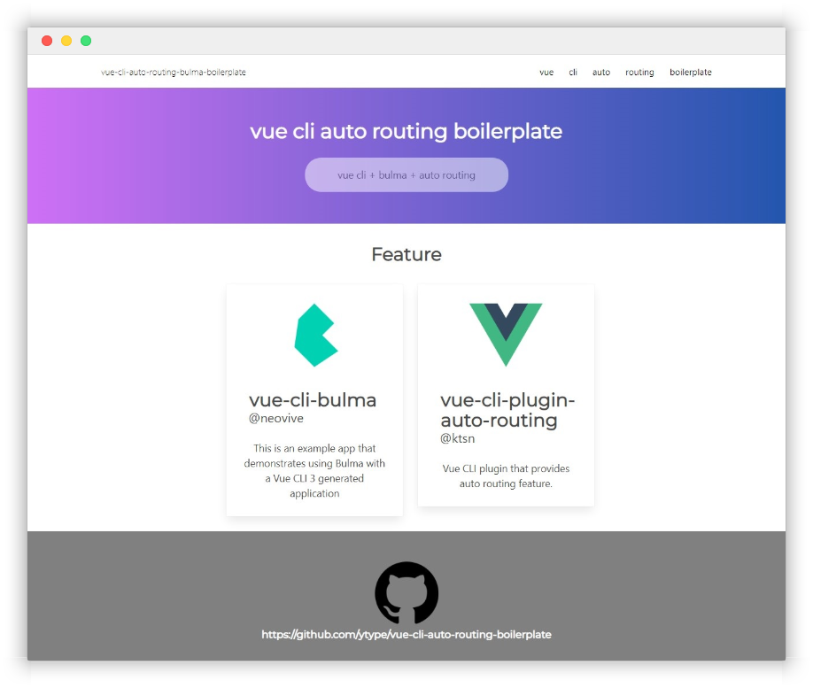

# vue-cli-auto-routing-bulma-boilerplate

> vue cli + bulma + auto routing

[http://vue-cli-auto-routing-bulma-boilerplate.surge.sh/](http://vue-cli-auto-routing-bulma-boilerplate.surge.sh/)



뷰 cli에 css framework bulma와 plugin auto routing을 추가한 boilerplate입니다.

## Installation

``` bash
git clone https://github.com/ytype/vue-cli-auto-routing-bulma-boilerplate.git
cd vue-cli-auto-routing-bulma-boilerplate
npm install
```

## Usage

``` bash
npm run serve
```

## wiki

[wiki]() 